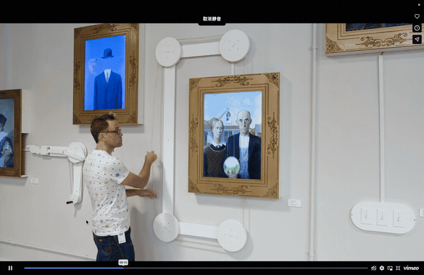

# Quiz 9

## Part 1: Project Direction

### Chosen Path
We will reinterpret an existing artwork.

### Artwork and Artist
**The Starry Night** by **Vincent van Gogh**.

### Team Vision
Our project vision is to reinterpret a classical artwork through pixelization and transform it into an interactive digital artwork. The original work we chose is *The Starry Night* by Vincent van Gogh. The first key inspiration is *TrendHunter: The Interactive Starry Night*, which showed us how a famous painting can be reimagined with interactive behavior. Our updated concept differs by converting the artwork into a pixel-based system, making visual transformation and control clearer, more modular, and easier to map to interaction behaviors in our system. The second inspiration is *Designboom: Mechanical Masterpieces Reimagines Famous Paintings*. Although that project uses physical mechanical interaction, it inspired our interaction logic. We adapt that idea into computer-based interaction, using creative coding to let users actively reshape a reconstructed classical image.

### Inspiration Images

### Inspiration Sources
- [TrendHunter: The Interactive Starry Night](https://www.trendhunter.com/trends/interactive-starry-night)
- [Designboom: Mechanical Masterpieces Reimagines Famous Paintings](https://www.designboom.com/art/mechanical-masterpieces-reimagines-famous-paintings-10-09-2020/)
- [MoMA collection entry: The Starry Night](https://www.moma.org/collection/works/79802)
- [Wikimedia: Van Gogh - The Starry Night](https://commons.wikimedia.org/wiki/File:Van_Gogh_-_Starry_Night_-_Google_Art_Project.jpg)

---

## Part 2: Mechanics

### Team Members and Ownership
- Zhang Wang (`zwan0001`): Audio mechanic
- Shaojie Dai (`sdai0419`): User input (mouse and keyboard) mechanic
- Shuaiyu Zhou (`szho0686`): Perlin noise and randomness mechanic

### Audio Mechanic (Zhang Wang, zwan0001)
The audio mechanic converts frequency and amplitude data into visual energy on the pixel canvas. In practice, low frequencies will influence large swirl areas in the sky, while mid and high frequencies will modulate local brightness, color shift, and twinkle intensity around stars. When the soundtrack becomes louder or denser, the pixel strokes will appear to thicken and pulse, creating a sense that the painting is breathing. User interaction with this mechanic is indirect: the audience presses play and experiences a continuously changing visual state driven by the sound itself. This mechanic connects to our project vision by replacing van Gogh’s static brushstroke rhythm with a living temporal rhythm, allowing the emotional force of the artwork to be felt as movement rather than only seen as a still image.

### User Input Mechanic (Shaojie Dai, sdai0419)
The user input mechanism enables viewers to directly control specific parts of the reconstructed painting through mouse operations. As the mouse moves, nearby pixel vectors are distorted to simulate the movement of a flowing brush; while a mouse click can trigger a local "pixel rotation", with the pixel points around the mouse position rotating around it. This mechanism is designed to be expressive yet restrictive, meaning that viewers can creatively intervene, while the work still maintains the visual style presented by the familiar artistic structure of "The Starry Night". This strongly supports our vision, as the reinterpretation here is not passive viewing: the viewers actively co-created the dynamics, contrasts, and emphases within the painting.

### Perlin Noise and Randomness Mechanic (Shuaiyu Zhou, szho0686)
The Perlin noise and randomness mechanic provides organic variation so the piece never feels repetitive or mechanically looped. My mechanic uses Perlin noise and randomness to recreate the expressive movement of Van Gogh’s The Starry Night. Randomness is used to generate varied brush strokes, star positions, colours, and sizes, so the image feels hand-painted rather than uniform. Perlin noise controls the movement, brightness, and direction of these elements over time, creating a smooth flowing effect instead of harsh random motion. This connects to the project vision by translating Van Gogh’s swirling brushwork and emotional night sky into a living digital system. This mechanic connects to our vision by translating van Gogh’s expressive unpredictability into code: instead of fixed pixels, the scene behaves like a living painted system where order and variation coexist.

### Mechanics Reference Image

---

## Part 3: Putting It Together

Our project combines all mechanics on one shared pixel canvas, but separates the painting into key regions: stars, the overall night-sky background, and the trees/village area. The stars are controlled by Perlin noise and randomness, which modulate star position, size, and flicker behavior. The night-sky background is controlled by mouse interaction, allowing users to influence flow and rotational motion. The trees and village are controlled by audio, so rhythm and intensity make the lower part of the scene feel more alive and inhabited. Together, these layered controls keep one coherent artwork while giving each mechanic a clear role.
